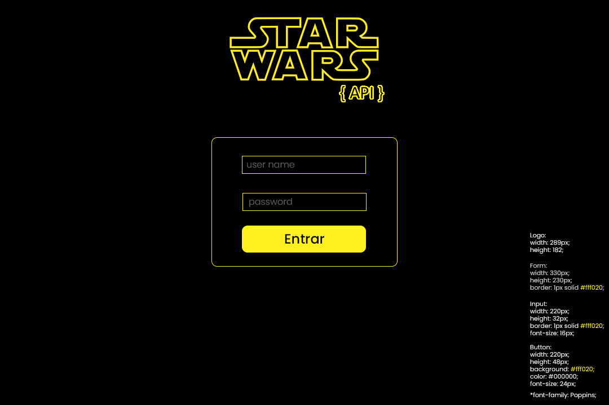
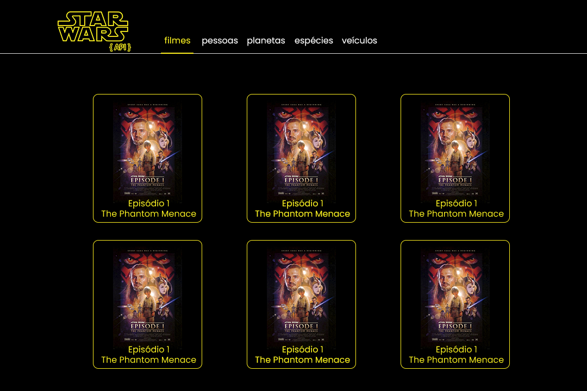
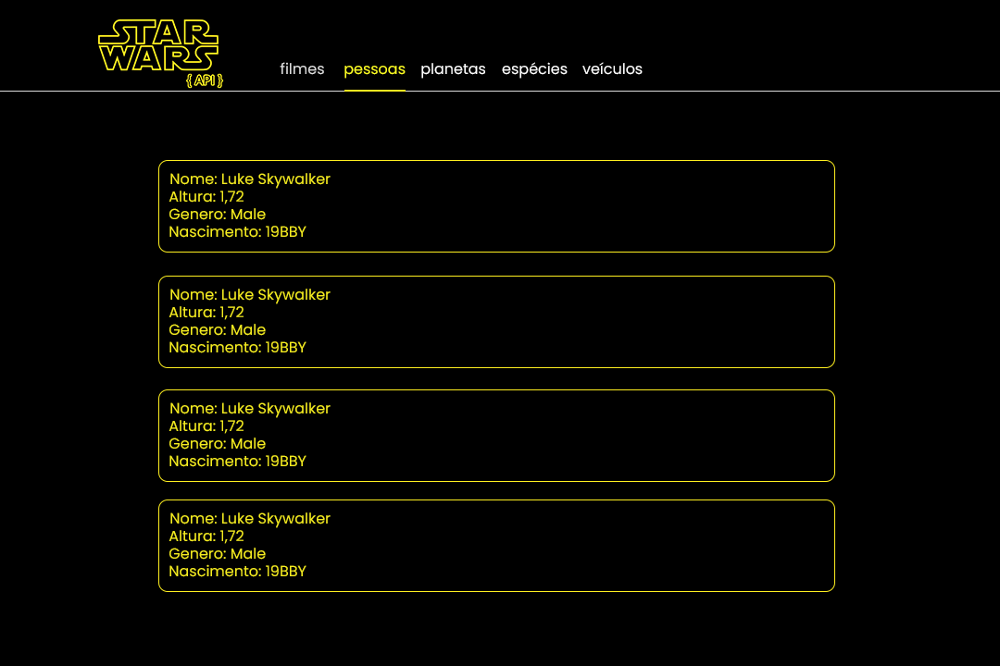

# SWAPI React - TypeScript

Este projeto foi criado com [Create React App](https://github.com/facebook/create-react-app).
E ele faz coleta os dados da API [The Star Wars API](https://swapi.dev/) em uma página mais amigável como pode observar nos exemplos de protótipos criados em Photoshop a seguir:

## Para rodar o projeto

Depois de clonar ou baixar o repositório é necessário instalar as dependências.
Um simples comando "yarn" na raiz do projeto é o suficiente.

### `yarn`

Dependências instaladas vamos rodar o projeto. E para isso basta digitar em seu terminal o comando:

### `yarn start`

A aplicação será aberta em:
 [http://localhost:3000](http://localhost:3000) to view it in the browser.

 
 ## Possibilidades

 A aplicação ainda não está totalmente concluída.

 A tela de login foi criada, porém as ferramentas de autenticação carecem de implementação bem como a tratativa de URL mais amigáveis.

 Ainda é possível trazer maior riqueza de detalhes em cada item clicado aproveitando todas as informações da API.

 O designer das páginas foi criado de forma minimalista podendo também ser aprimorado.